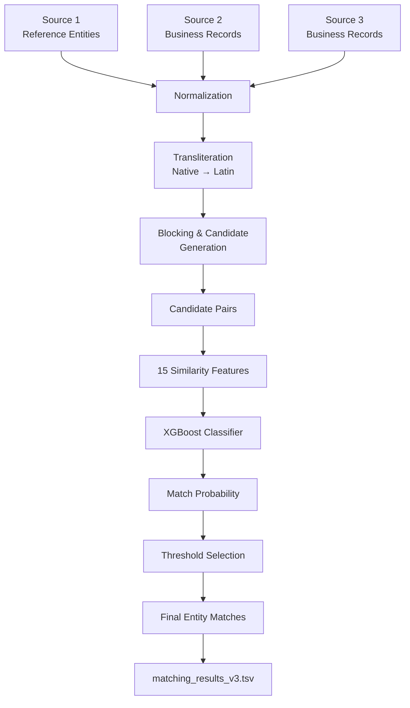
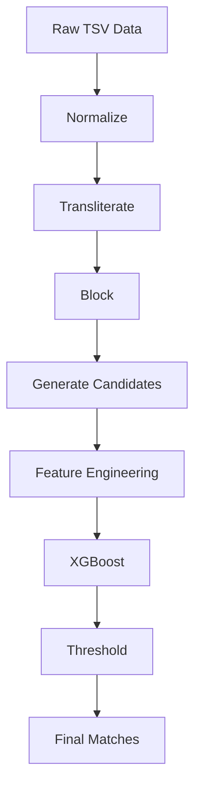
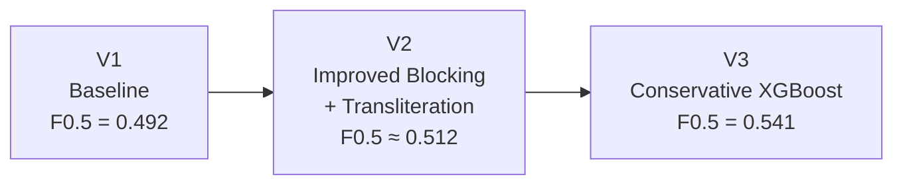
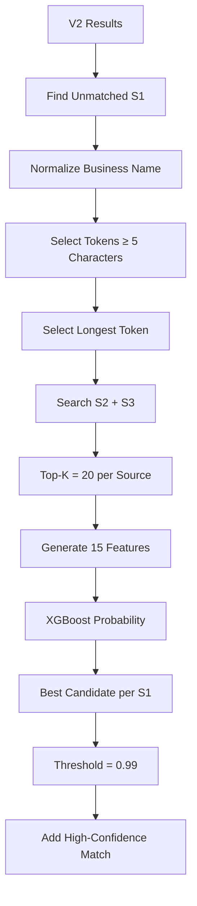
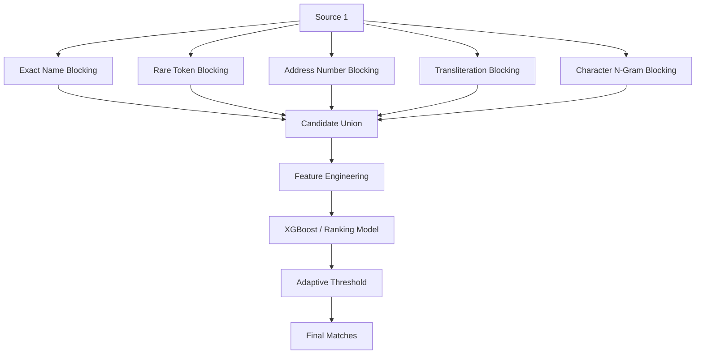

# Amazon ML Challenge 2026

### 🔗 Large-Scale Business Entity Resolution using Intelligent Blocking & XGBoost

> A scalable machine learning pipeline for resolving millions of noisy business records across three independent data sources using normalization, transliteration, intelligent blocking, candidate generation, similarity features, and XGBoost.

<p align="center">


</p>

---

## 📑 Table of Contents

- [🏆 Competition Result](#-competition-result)
- [🎯 1. Problem Statement](#-1-problem-statement)
- [📊 2. Dataset Scale](#-2-dataset-scale)
- [⚠️ 3. The Main Computational Challenge](#️-3-the-main-computational-challenge)
- [🚀 4. Core Idea](#-4-core-idea)
- [🏗️ 5. System Architecture](#️-5-system-architecture)
- [🔄 6. End-to-End Pipeline](#-6-end-to-end-pipeline)
- [🧹 7. Data Preprocessing](#-7-data-preprocessing)
- [🌐 8. Transliteration](#-8-transliteration)
- [🔎 9. Blocking & Candidate Generation](#-9-blocking--candidate-generation)
- [📉 10. Search-Space Reduction](#-10-search-space-reduction)
- [🧩 11. Candidate Generation vs Matching](#-11-candidate-generation-vs-matching)
- [🧠 12. Feature Engineering](#-12-feature-engineering)
- [🤖 13. XGBoost Entity Matcher](#-13-xgboost-entity-matcher)
- [🎯 14. Precision-Aware Thresholding](#-14-precision-aware-thresholding)
- [🧪 15. Training Strategy](#-15-training-strategy)
- [🔄 16. V1 → V2 → V3](#-16-v1--v2--v3)
- [⚡ 17. V3 Conservative Pipeline](#-17-v3-conservative-pipeline)
- [💾 18. Large-Scale Data Processing](#-18-large-scale-data-processing)
- [📦 19. Final Test Output](#-19-final-test-output)
- [📊 20. Final Results Dashboard](#-20-final-results-dashboard)
- [🔑 21. Key Technical Insights](#-21-key-technical-insights)
- [⚠️ 22. Limitations](#️-22-limitations)
- [🚀 23. Future Improvements](#-23-future-improvements)
- [🛠️ 24. Technology Stack](#️-24-technology-stack)
- [📁 25. Repository Structure](#-25-repository-structure)
- [📄 26. Model Artifact](#-26-model-artifact)
- [📤 27. Submission Outputs](#-27-submission-outputs)
- [📚 28. What I Learned](#-28-what-i-learned)
- [⭐ 29. Final Takeaway](#-29-final-takeaway)
- [👩‍💻 Author](#author)

---

## 🏆 Competition Result

| Metric | Result |
|---|---:|
| **Final F0.5 Score** | **0.541** |
| **Rank** | **5,681 / 89,399 registrations** |
| **Best Version** | **V3** |
| **Final Model** | **XGBoost** |
| **Challenge** | Amazon ML Challenge 2026 |
| **Hackathon Duration** | 72 Hours |

### 📈 Iterative Performance

| Version | Main Improvement | F0.5 |
|---|---|---:|
| V1 | Baseline blocking + matching | **0.492** |
| V2 | Improved candidate generation + transliteration | **~0.512** |
| **V3** | **Conservative XGBoost candidate expansion** | **0.541** |

---

## 🎯 1. Problem Statement

The challenge was to perform **Business Entity Resolution** across three independent data sources.

The objective was to determine which records in **Source 2** and **Source 3** represent the same real-world business as each entity in **Source 1**.

A Source 1 entity can have:

- zero matches
- one match
- multiple matches

across Source 2 and Source 3.

### Example

```text
Source 1
┌──────────────────────────────┐
│ S1-001                       │
│ ABC Enterprises Pvt Ltd      │
│ Mumbai, India                │
└──────────────┬───────────────┘
               │
               │ Entity Resolution
        ┌──────┴───────┐
        ▼              ▼
┌───────────────┐  ┌───────────────┐
│ Source 2      │  │ Source 3      │
│ ABC Enterprise│  │ एबीसी          │
│ Pvt. Limited  │  │ Enterprises   │
└───────────────┘  └───────────────┘
```

The difficulty comes from noisy real-world data:

- spelling variations
- abbreviations
- punctuation differences
- typos
- transliteration
- missing address components
- address formatting differences
- different word ordering
- legal-name variations

---

## 📊 2. Dataset Scale

The challenge contains three business-record sources.

| Source | Purpose | Scale |
|---|---|---:|
| Source 1 (S1) | Deduplicated reference entities | 2,206,821 |
| Source 2 (S2) | Business records | 5,034,616+ |
| Source 3 (S3) | Business records | Large-scale source |

The training ground truth contains **2,206,821** Source 1 entities.

For the final test set, the pipeline processed:

```text
1,732,544 Source 1 entities
```

Every Source 1 test entity had to appear in the final submission.

---

## ⚠️ 3. The Main Computational Challenge

The naive solution would compare every Source 1 record against every Source 2 and Source 3 record.

For only Source 1 × Source 2:

```text
2,206,821 × 5,034,616
```

which gives approximately:

```text
11.10 TRILLION comparisons
```

And this does not include Source 3.

A brute-force approach would therefore be computationally impractical.

The actual question was:

> How can we reduce a trillion-scale search space to a manageable number of plausible candidate pairs without losing too many true matches?

---

## 🚀 4. Core Idea

The solution separates the problem into two stages:

```text
                 HUGE SEARCH SPACE
                        │
                        ▼
              ┌──────────────────┐
              │ Blocking &       │
              │ Candidate        │
              │ Generation       │
              └────────┬─────────┘
                       │
                       ▼
               SMALLER CANDIDATE
                    SET
                       │
                       ▼
              ┌──────────────────┐
              │ XGBoost Matcher  │
              │ + Similarity     │
              │   Features       │
              └────────┬─────────┘
                       │
                       ▼
                FINAL MATCHES
```

**Key principle**

> Blocking controls scalability.
> Machine learning controls matching quality.

---

## 🏗️ 5. System Architecture



---

## 🔄 6. End-to-End Pipeline



**Pipeline stages**

```text
1. Load raw data
        ↓
2. Normalize names & addresses
        ↓
3. Extract address numbers
        ↓
4. Generate transliterated fields
        ↓
5. Apply blocking strategies
        ↓
6. Generate candidate pairs
        ↓
7. Calculate similarity features
        ↓
8. Train / apply XGBoost
        ↓
9. Generate match probabilities
        ↓
10. Select high-confidence matches
        ↓
11. Generate final submission
```

---

## 🧹 7. Data Preprocessing

Raw business data cannot be directly compared because the same entity may have multiple textual representations.

### Normalization

The pipeline performs:

- Unicode normalization
- lowercasing
- punctuation handling
- whitespace normalization
- tokenization
- numeric extraction

Example:

```text
"ABC Pvt. Ltd., Mumbai"
             ↓
"abc pvt ltd mumbai"
```

### Address Number Extraction

Numbers are extracted separately because they are often highly informative:

```text
"Shop 12, Building 45, MG Road"
                  ↓
             {12, 45}
```

---

## 🌐 8. Transliteration

The same business may appear in different scripts.

The pipeline creates transliterated representations using Unidecode.

```text
Original Name
      │
      ▼
Normalization
      │
      ▼
Transliteration
      │
      ▼
Comparable Representation
```

This creates additional matching signals for multilingual and transliterated business records.

---

## 🔎 9. Blocking & Candidate Generation

Comparing every possible pair is infeasible.

Blocking reduces the search space by selecting only records that share useful signals.

**Blocking strategies explored**

- Exact name matching
- Exact address matching
- Token-based blocking
- Selective token blocking
- Transliteration-aware blocking
- Address-number analysis
- Rare-token analysis
- Conservative name-token blocking

---

## 🔎 10. Search-Space Reduction

Entity resolution becomes computationally expensive when every Source 1
record is compared with every Source 2 / Source 3 record.

For the training data alone:

**2,206,821 S1 × 5,034,616 S2**

≈ **11.11 trillion possible S1–S2 comparisons**

This illustrates the scale of the brute-force search space.

Instead of exhaustive comparison, the pipeline uses blocking and candidate
generation to identify only plausible pairs.

### Test Candidate Generation

For the final test pipeline:

| Blocking Stage | Candidate Pairs |
|---|---:|
| Exact-name matching | 10,882,180 |
| Exact-address matching | 655,494 |
| **Combined candidate pairs** | **11,452,975** |

The XGBoost matcher then scored these **11.45 million candidate pairs**
instead of performing an exhaustive comparison across the full search space.

```text
                 BRUTE-FORCE CONCEPT
                        │
                        ▼
              Trillion-scale search
                        │
                        │ Blocking
                        ▼
             Candidate Generation
                        │
                        ▼
                11.45M candidates
                        │
                        │ XGBoost
                        ▼
                 Final Matches
```

---

## 🧩 11. Candidate Generation vs Matching

These are two different problems.

**Candidate Generation**

> Question: Could these two records potentially represent the same business?
>
> Goal: High Recall — Avoid missing true matches

**ML Matching**

> Question: Given that these records are candidates, how likely are they to be the same business?
>
> Goal: High Precision — Avoid incorrect entity merges

Therefore:

```text
Large Dataset
     │
     ▼
Candidate Generation
     │
     ▼
Millions of Candidates
     │
     ▼
ML Matching
     │
     ▼
High-Confidence Matches
```

---

## 🧠 12. Feature Engineering

Each candidate pair is represented using **15 similarity features**.

**Name Features**

| Feature |
|---|
| name_ratio |
| name_token_overlap |
| name_jaccard |
| trans_name_ratio |
| trans_name_overlap |

**Address Features**

| Feature |
|---|
| address_ratio |
| address_token_overlap |
| address_jaccard |
| trans_address_ratio |
| number_overlap |

**Metadata & Structural Features**

| Feature |
|---|
| exact_name |
| exact_address |
| country_match |
| name_length_diff |
| address_length_diff |

---

## 🤖 13. XGBoost Entity Matcher

The final ML matcher uses XGBoost.

The model learns how multiple weak similarity signals combine to distinguish:

```text
1 → Same Business
0 → Different Business
```

**Model Configuration**

```text
Trees              : 350
Maximum Depth      : 6
Learning Rate      : 0.05
Subsample          : 0.8
Column Subsample   : 0.8
Tree Method        : hist
```

The model outputs:

```text
P(Same Business | Candidate Pair)
```

Example:

```text
Candidate A → 0.998
Candidate B → 0.934
Candidate C → 0.421
Candidate D → 0.052
```

---

## 🎯 14. Precision-Aware Thresholding

The competition uses F0.5, which gives greater importance to precision.

The evaluation metric is:

```text
F0.5 = (1.25 × Precision × Recall)
       --------------------------------
       (0.25 × Precision + Recall)
```

This makes false positive matches particularly costly.

Therefore, threshold selection is critical.

The final V3 expansion stage used:

```text
Threshold = 0.99
```

Only high-confidence candidates were accepted.

---

## 🧪 15. Training Strategy

Training data was constructed from the provided ground truth.

**Positive pairs** — Known matching relationships:

```text
S1 ───────── S2
│
└─────────── S3
```

**Negative pairs** — Non-matching candidate pairs were sampled to train the binary classifier.

```text
Positive → 1
Negative → 0
```

The model was trained using an **entity-level split**, keeping Source 1 entities separated between training and validation.

This reduces leakage compared with randomly splitting individual candidate pairs.

---

## 🔄 16. V1 → V2 → V3

The solution was developed iteratively.



**V1 — Baseline**
Established the initial entity-resolution pipeline using blocking and similarity-based matching.

**V2 — Candidate Improvement**
Improved candidate generation using additional signals and transliteration.

Result:

```text
0.492 → ~0.512
```

**V3 — Conservative ML Expansion**
Focused on previously unmatched Source 1 entities and generated bounded candidate sets.

Result:

```text
~0.512 → 0.541
```

---

## ⚡ 17. V3 Conservative Pipeline

V3 specifically targeted Source 1 entities that remained unmatched after V2.



**V3 Configuration**

```text
Chunk size      : 5,000 S1 entities
Top-K           : 20 candidates/source
Threshold       : 0.99
Model           : XGBoost
```

DuckDB was used to perform efficient lookups and process the large dataset in chunks.

---

## 💾 18. Large-Scale Data Processing

The project used DuckDB for analytical processing and efficient candidate lookup.

Instead of loading every large intermediate dataset into memory simultaneously, the pipeline used:

- DuckDB tables
- chunked processing
- normalized lookup tables
- candidate tables
- prediction batches

This made the pipeline practical on a local development environment.

---

## 📦 19. Final Test Output

The final test set contained:

```text
Source 1 test entities
        ↓
1,732,544
```

The final pipeline generated:

```text
matching_results_v3.tsv
candidate_pairs_v3.tsv
```

**Validation**

```text
Required S1 entities : 1,732,544
Matching rows        : 1,732,544
Candidate rows       : 1,732,544
Duplicate S1 IDs     : 0
Validation           : PASS
```

The final output satisfied the structural submission requirements.

---

## 📊 20. Final Results Dashboard

```text
┌────────────────────────────────────────────┐
│          AMAZON ML CHALLENGE 2026           │
├────────────────────────────────────────────┤
│                                              │
│              F0.5 SCORE                     │
│                0.541                        │
│                                              │
│              RANK                           │
│           5,681 / 89,399                    │
│                                              │
│         BEST VERSION: V3                    │
│                                              │
└────────────────────────────────────────────┘
```

**Performance Progression**

```text
V1   ████████████████████   0.492
V2   █████████████████████  0.512
V3   ██████████████████████ 0.541
```

---

## 🔑 21. Key Technical Insights

**1. Blocking is critical**

A strong ML model cannot recover a true match that was never generated as a candidate.

```text
No Candidate
     ↓
No ML Prediction
     ↓
No Possible Match
```

**2. Candidate recall creates the upper bound**

```text
Candidate Generation
        ↓
Maximum achievable recall
```

**3. Model quality controls candidate precision**

```text
Candidate Pairs
      ↓
XGBoost
      ↓
High-confidence matches
```

**4. Threshold matters**

A higher threshold improves precision but may reduce recall.

The final solution deliberately favored precision because of the F0.5 evaluation metric.

---

## ⚠️ 22. Limitations

The final solution has several limitations.

**Candidate Recall**
Some true matches may never enter the candidate set.

**Single-Token V3 Blocking**
V3 uses a conservative longest-token strategy, which can miss:

- abbreviations
- unusual transliterations
- missing tokens
- different business-name representations

**Top-K Limitation**
V3 limits candidates to:

```text
20 candidates per source
```

Highly frequent tokens may therefore cause candidate truncation.

**Conservative Threshold**

```text
0.99
```

is intentionally strict and can reduce recall.

---

## 🚀 23. Future Improvements

A potential V4 system could use multi-pass blocking:



Potential improvements:

- Multi-pass blocking
- Rare-token blocking
- Address-number blocking
- Character n-gram similarity
- TF-IDF similarity
- Phonetic similarity
- Candidate recall optimization
- Adaptive thresholds
- Learning-to-rank
- Probability calibration
- Cross-dataset validation

---

## 🛠️ 24. Technology Stack

**Programming**
Python · SQL

**Data Processing**
Pandas · NumPy · DuckDB

**Machine Learning**
XGBoost · Scikit-learn

**Similarity / NLP**
RapidFuzz · Unidecode

**Development**
VS Code · Git · GitHub

---

## 📁 25. Repository Structure

```text
Amazon-ML-Challenge-2026/
│
├── README.md
├── requirements.txt
├── .gitignore
│
├── src/
│   ├── analysis/
│   ├── preprocessing/
│   ├── blocking/
│   ├── model/
│   └── pipeline/
│
├── experiments/
│
├── results/
│
├── model/
│   ├── entity_matcher.json
│   ├── feature_names.txt
│   └── threshold.txt
│
└── docs/
```

> Large datasets and generated intermediate files are intentionally excluded from the GitHub repository.

---

## 📄 26. Model Artifact

The trained XGBoost model is included:

```text
model/entity_matcher.json
```

Model size:

```text
~2.24 MB
```

Additional metadata:

```text
feature_names.txt
threshold.txt
```

---

## 📤 27. Submission Outputs

The challenge required two output files.

### matching_results.tsv

Final predicted entity matches:

```text
source1_entity_id    matched_entity_ids
S1-00001              S2-00047,S3-00812
S1-00002              S3-00004
S1-00003
```

### candidate_pairs.tsv

Final candidate set passed to the matching stage:

```text
source1_entity_id    candidate_entity_ids
S1-00001              S2-00047,S2-00193,S3-00812
S1-00002              S3-00004
S1-00003
```

The final matches must be a subset of the generated candidate set.

---

## 📚 28. What I Learned

This project provided practical experience with:

- Large-scale entity resolution
- Record linkage
- Blocking and candidate generation
- Noisy-text normalization
- Transliteration
- Fuzzy string matching
- Similarity feature engineering
- Negative sampling
- Entity-level validation
- XGBoost classification
- Threshold optimization
- DuckDB
- Chunked processing
- Memory-aware ML pipelines
- Precision/recall trade-offs

---

## ⭐ 29. Final Takeaway

The central lesson from this challenge was:

> Large-scale entity resolution is not simply a classification problem. It is a search-space reduction problem followed by classification.

The final system combines:

```text
                 ┌───────────────────┐
                 │  Raw Business Data│
                 └─────────┬─────────┘
                           ↓
                 ┌───────────────────┐
                 │  Normalization    │
                 └─────────┬─────────┘
                           ↓
                 ┌───────────────────┐
                 │  Transliteration  │
                 └─────────┬─────────┘
                           ↓
                 ┌───────────────────┐
                 │ Blocking &        │
                 │ Candidate Search  │
                 └─────────┬─────────┘
                           ↓
                 ┌───────────────────┐
                 │ 15 Similarity     │
                 │ Features          │
                 └─────────┬─────────┘
                           ↓
                 ┌───────────────────┐
                 │     XGBoost       │
                 └─────────┬─────────┘
                           ↓
                 ┌───────────────────┐
                 │ Probability +     │
                 │ Thresholding      │
                 └─────────┬─────────┘
                           ↓
                 ┌───────────────────┐
                 │ Final Entity      │
                 │ Resolution        │
                 └───────────────────┘
```

**Final Competition Performance**

```text
F0.5: 0.541
Rank: 5,681 / 89,399 registrations
```

---

<a name="author"></a>
## 👩‍💻 Author

---

**Akshata Jadhav**

M.Tech — Computer Engineering

Interested in:

`Machine Learning` • `Generative AI` • `Agentic AI` • `Data Science`
